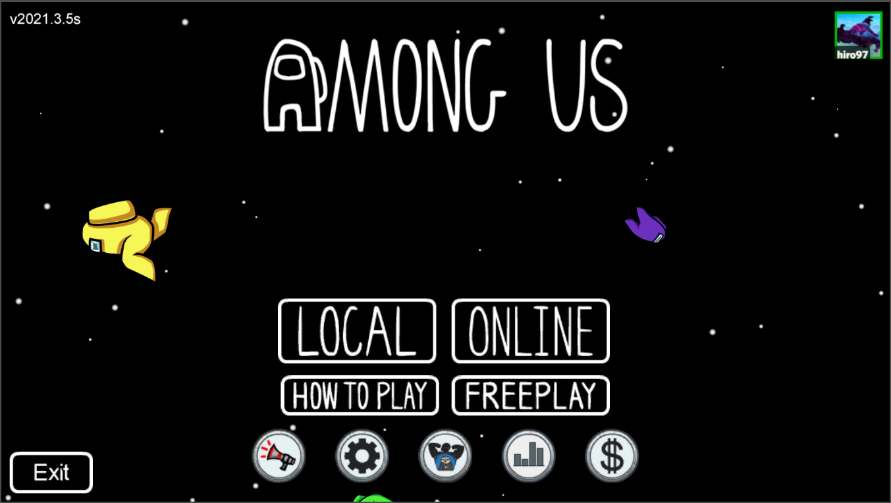
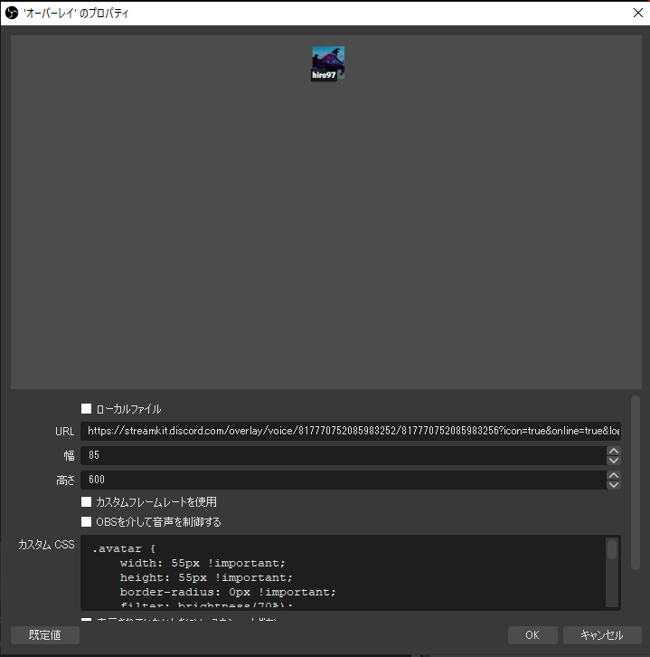

# obs-discord-streamkit-overlay
  

### 使い方
1. https://streamkit.discord.com/overlay にアクセスし、"Install For Obs"を選択.
2. VOICE WIDGETタブで、オーバーレイをしたいDiscord ServerとVoice Channelを選択.
3. 画面右下のURLをコピーし、OBSのソースで"ブラウザ"を選択.
4. コピーしたURLを画像のURLに、[css/custom.css](css/custom.css)をカスタムCSSに貼り付ける.
  
